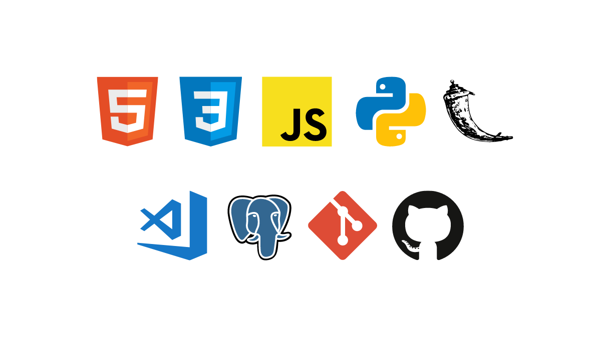

### Hi there 👋 iam [Ashik Meeran Mohideen](https://www.linkedin.com/in/ashik-meeran-mohideen)
- 🌐 I am a Full stack web developer.
- ⚡ Currently i'am working on my project [**Swito.**](https://swito.herokuapp.com)
- ▶️ I also do [**YouTube**](https://www.youtube.com/channel/UCnhoJiStmQvt2RWJ89_t_ig?view_as=subscriber).
- 🔥 Ask me about any stuff related to web.
- 📍 Reach out to me through [**LinkedIn**](https://www.linkedin.com/in/ashik-meeran-mohideen) or [**Email**](mailto:ashikmeeranmohideen@gmail.com)

### Languages and Tools:

 

--- 

  &nbsp;&nbsp;
  &nbsp;&nbsp;
  &nbsp;&nbsp;
  &nbsp;&nbsp;

---

### 📺 Latest YouTube Videos

<!-- YOUTUBE:START -->
- [EP 07: Files in Flask: Save uploaded files to filesystem and sending file attachments](https://www.youtube.com/watch?v=Bj4cjo5R_6s)
- [EP 06: Todo application in Flask with Database &lpar;Part II&rpar;](https://www.youtube.com/watch?v=bVMfUp5dozU)
- [EP 05: Todo application in Flask with Database &lpar;Part I&rpar;](https://www.youtube.com/watch?v=P1Gj-OK2oXg)
- [EP 04: ORM&#39;s in Flask: Query database using objects instead of raw SQL.](https://www.youtube.com/watch?v=7C_zr5f9ed4)
- [EP 03: URL Shortner: Create shortened URL&#39;s using Flask &lpar;with Database&rpar; | &lpar;From scratch | 2021&rpar;](https://www.youtube.com/watch?v=ilW7g7nddM0)
<!-- YOUTUBE:END -->

➡️ [more videos...](https://www.youtube.com/channel/UCnhoJiStmQvt2RWJ89_t_ig?view_as=subscriber)

---

### Github Stats
 

 

